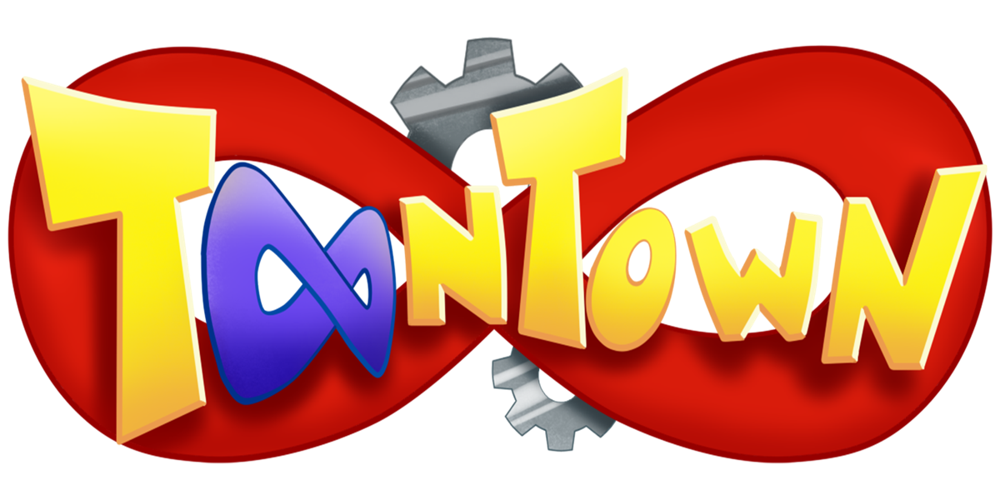

**A free, non-profit game inspired by *Disney's Toontown Online*.**

**[Download](https://infinite.toontown.io/play)** · [Website](https://infinite.toontown.io) · [Discord](https://discord.toontown.io) · [Contributing](CONTRIBUTING.md)

---

## About

Toontown Infinite was a fan-made Toontown game that ran through the late 2010s. This repository keeps its source code preserved and open.

It is an archive first. It isn't trying to carry the original team's roadmap forward. It still gets bug fixes, a move to Python 3.14 and Panda3D 1.11, and official builds that you can download and play today.

## Playing

1. Go to the [download page](https://infinite.toontown.io/play) and get the launcher for **Windows**, **macOS** or **Linux**.
2. Install it, sign in, and press **Play**.

The launcher can also start a server on your own computer, so you can play alone or host a district for your friends.

## Getting help

Please ask for help with installing, logging in or starting the game on [Discord](https://discord.toontown.io). GitHub issues in this repository are only for code problems, so setup questions posted there won't be answered.

## Contributing

Want to fix a bug or run the game from source? Read [CONTRIBUTING.md](CONTRIBUTING.md).

---

Toontown Infinite is a fan project. It is not affiliated with, endorsed by or sponsored by The Walt Disney Company. *Toontown Online* and its characters belong to their respective owners.